# EJERCICIO 1- MANUAL DE DOCKER

> Realizado por Andrea Gómez Fueyo y Sandra Rujas Arroyo

[TOC]

<div style="page-break-after: always; break-after: page;"></div>


Docker Desktop es una aplicación que permite a los desarrolladores construir, compartir y ejecutar aplicaciones en contenedores de manera sencilla. Este manual proporciona una guía básica para su instalación, configuración y uso.

## **1. Instalación de Docker Desktop**

#### **1.1** **Requisitos del Sistema**

- Windows 10/11 (con WSL2 habilitado) o macOS 10.14+
- Procesador de 64 bits con soporte para virtualización
- Al menos 4 GB de RAM

#### **1.2** **Pasos de Instalación**

Descargamos Docker Desktop desde el sitio oficial: https://www.docker.com/products/docker-desktop.


-1739526211336-20.png)

Ejecutamos el instalador y seguimos las instrucciones en pantalla.

-1739526230696-22.png)

Reiniciamos el sistema si es necesario.

-1739526247570-24.png)

.png)

Iniciamos Docker Desktop y verificamos que esté corriendo desde la barra de tareas o con el comando:

```bash
docker --version
```

-1739526320480-28.png)

## **2. Configuración Inicial**

Configuramos Docker, le damos uso de manera *“Personal”*. Si ya tenemos una cuenta de Docker, debemos introducirla en la casilla de *“Email address”.* 

-1739526378393-30.png)

Si por el contario no tenemos, deberemos darle a la casilla de *“Create an account”* para crearnos una cuenta nueva. Tenemos la opción de poder utilizar nuestra cuenta de *Google* o *Github*, si no queremos crear una cuenta desde cero. 

-1739525522875-4.png)

Pongamos que si tenemos una cuenta creada, pulsamos la tecla de *Sign in* que podemos observar en la imagen anterior y a continuación, nos saldrá la siguiente imagen:

-1739525708474-6.png)

Una vez entramos en nuestra cuenta, podemos lanzar el Docker Desktop:

-1739525730651-8.png)

-1739525740998-10.png)

-1739526103106-12.png)

## **3.** **Interfaz de Docker Desktop**

Cuando abres **Docker Desktop**, verás varias secciones clave:

####  **3.1.** **Dashboard (Tablero de control)**

 *Página principal* donde puedes visualizar y gestionar tus contenedores, imágenes, volúmenes y redes. Aquí puedes:

- **Ver contenedores activos y detenidos**: Muestra una lista de contenedores en ejecución, con información como su estado, nombre, imagen y puertos expuestos.
- **Iniciar y detener contenedores**: Puedes iniciar, detener y eliminar contenedores desde esta interfaz.
- **Visualizar logs**: Para ver el registro de eventos de los contenedores y facilitar la depuración.

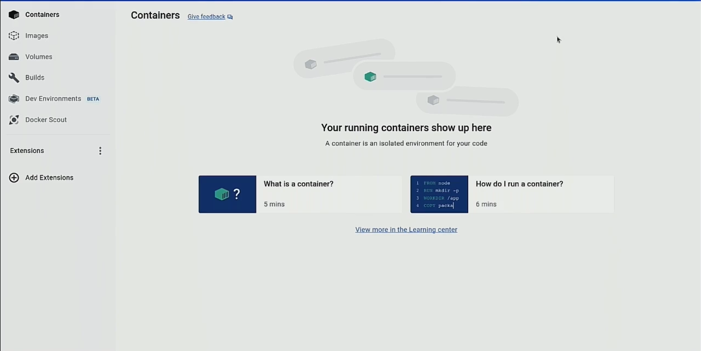


#### **3.2.** **Images (Imágenes)**

A través del área de *imágenes*, podemos gestionar todas las **imágenes Docker**. Las imágenes son plantillas para crear contenedores. Desde esta sección puedes:

- **Buscar y descargar imágenes**: Con el botón "Pull", puedes buscar imágenes oficiales o personalizadas desde Docker Hub y otras fuentes.

**Ejemplo práctico:** Vamos al área de Docker hub  y buscamos la imagen que queramos descargar. En nuestro ejemplo es la última imagen de mariadb:

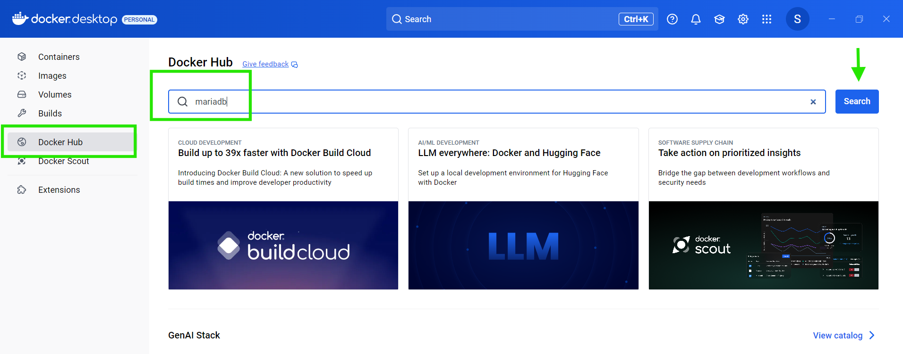

Nos aparecen las diferentes imágenes que existen con dicho nombre:

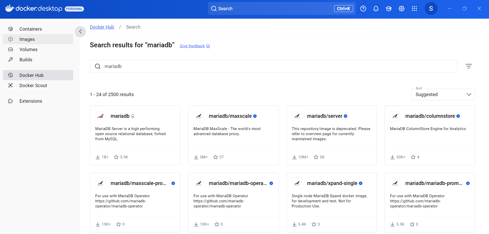

Seleccionamos la oficial y clickamos en *Pull* para descargarla:

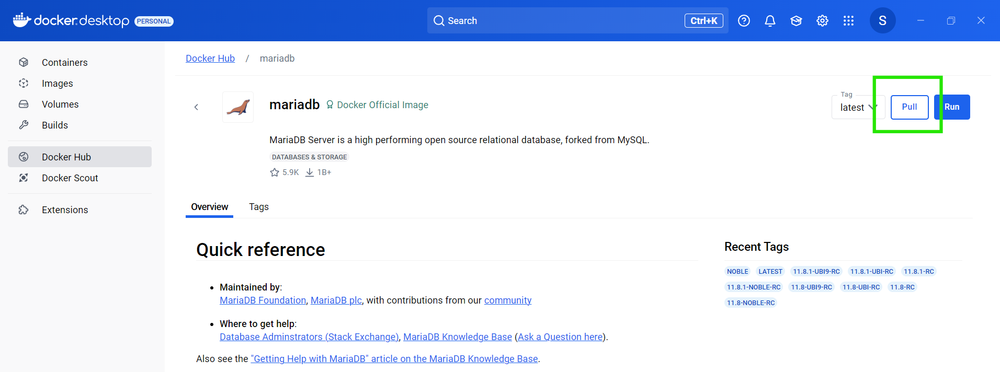

También podemos hacerlo a través el área de imágenes. Pulsamos sobre el buscador *"Search"* y escribimos el nombre de la imagen que queramos descargar. En nuestro caso hemos puesto *"mariadb"*, por lo que nos aparecerá la última imagen. Seguidamente daríamos click en *RUN* y se descargaría:

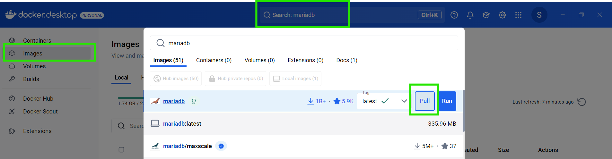

- **Eliminar imágenes**: Puedes eliminar imágenes que no estés utilizando, ya que si dicha imagen está en uso, no será posible su eliminación. 

.png)

- **Ver detalles**: Información detallada sobre cada imagen, como el tamaño y las etiquetas.

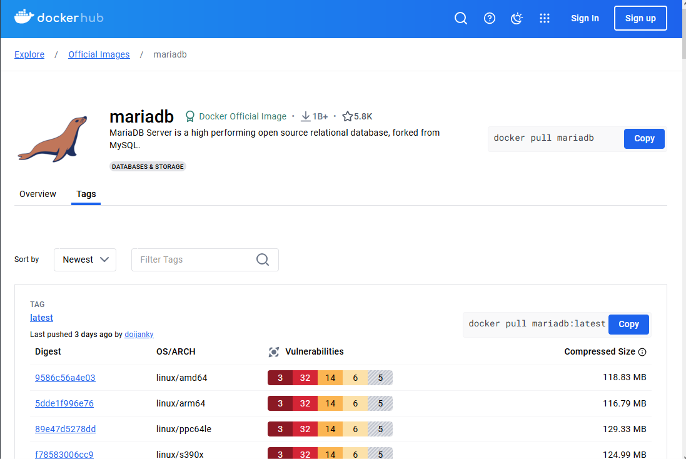

#### **3.3.** **Containers (Contenedores)**

Desde aquí puedes:

- **Gestionar contenedores**: Configurar, detener, eliminar, pausar y reiniciar contenedores. Puedes interactuar con los contenedores sin tener que usar la terminal.

Si pulsamos en *Optional settings,* podremos configurar los datos de nuestro contenedor:

-1739530453590-36.png)

-1739530538230-38.png)

Una vez introducidos los datos, pulsamos en *RUN* para su creación. En el área de *"containers"* te aparecerá lo siguiente:

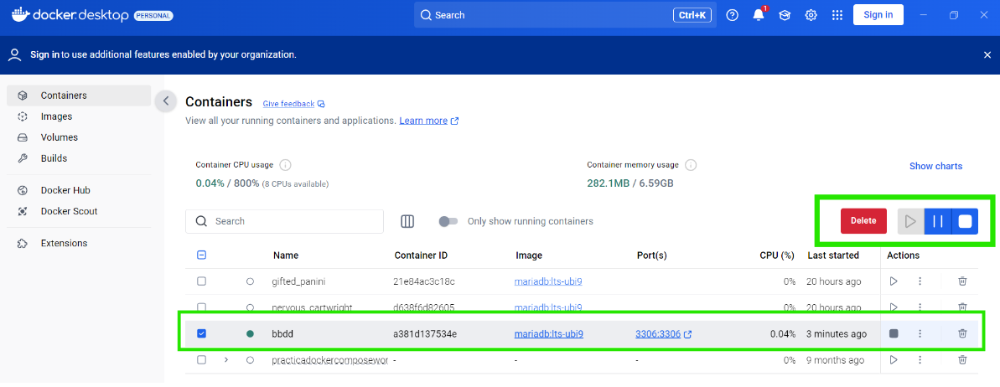


- **Ver contenedores en ejecución**: Además de las acciones básicas, puedes ver los logs de cada contenedor, lo cual es útil para depurar. Los logs son los registros de salida generados por la aplicación que se ejecuta dentro de él. Estos registros incluyen mensajes de error, información de depuración, eventos del sistema y cualquier otro tipo de salida que la aplicación escriba en la consola estándar o de error.

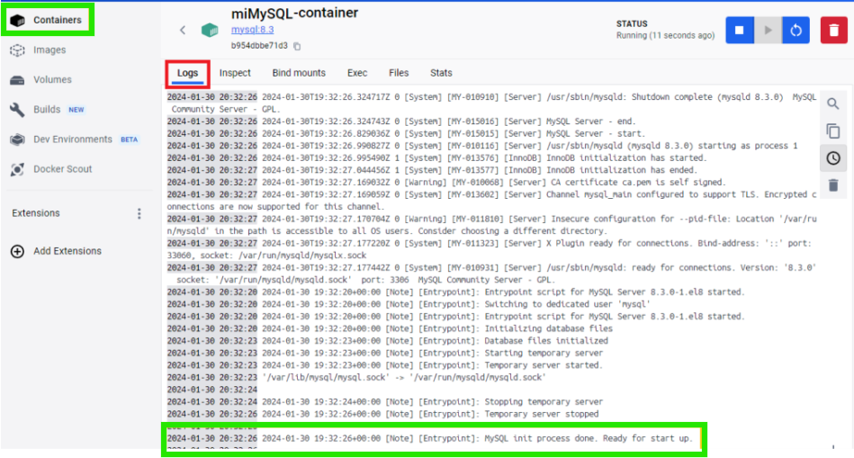


#### **3.4.** **Volumes (Volúmenes)**

Los volúmenes son espacios de almacenamiento persistentes fuera de los contenedores. Desde esta sección puedes:

- **Gestionar volúmenes**: Ver los volúmenes existentes, eliminarlos o crear nuevos.

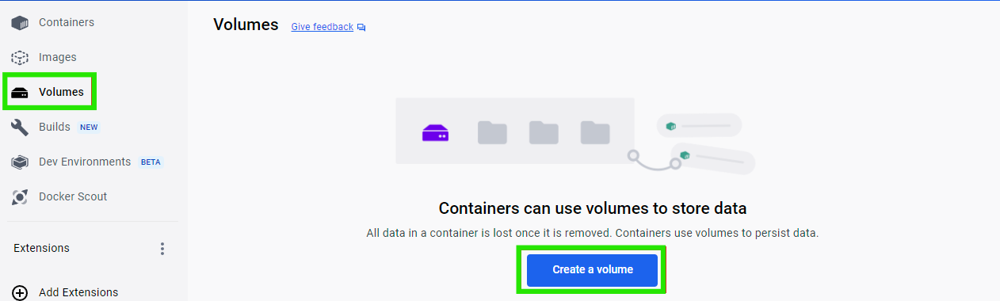

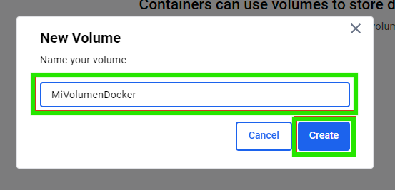

- **Usar volúmenes para persistencia de datos**: Puedes adjuntar volúmenes a contenedores para mantener los datos entre reinicios de contenedores.

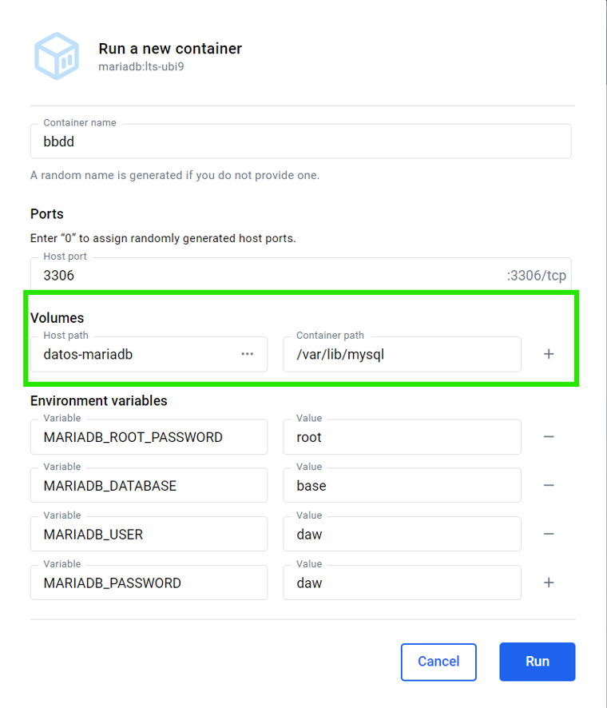

Este apartado de volúmenes que he seleccionado en la imagen anterior, se encuentra en la configuración de los contenedores, *(apartado "3.3 Containers").* A continuación, muestro como, después de haber introducido los datos de configuración del contenedor junto con su volumen *(con nombre: datos-mariadb)*, aparece en nuestra sección o área de volúmenes:

.png)


#### **3.5.** **Builds** (Construcciones)

El apartado **Builds** en Docker Desktop te permite construir imágenes **directamente desde la interfaz gráfica** sin tener que recurrir a la línea de comandos, aunque también puedes hacerlo desde la terminal usando el comando `docker build`.

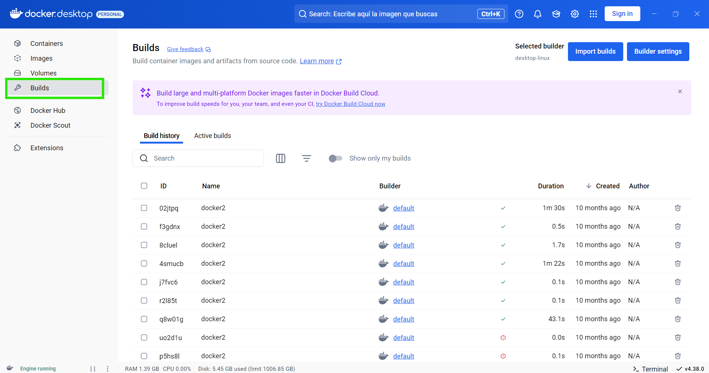

Con **Builds** en Docker Desktop, puedes:

1. **Crear nuevas imágenes**: Desde la interfaz, puedes crear una nueva imagen a partir de un **Dockerfile** que hayas preparado en tu proyecto. Esto es útil si estás trabajando en una aplicación y necesitas crear una imagen personalizada.
2. **Verificar el proceso de construcción**: Docker Desktop te muestra el progreso de la construcción de la imagen. Puedes ver qué pasos se están ejecutando (como la instalación de paquetes, la copia de archivos, etc.) y si ocurre algún error durante el proceso.
3. **Usar archivos `Dockerfile` existentes**: Si ya tienes un `Dockerfile` en tu proyecto, puedes seleccionarlo directamente en Docker Desktop y usarlo para crear la imagen. No es necesario escribir comandos complejos en la terminal para ejecutar un `docker build`.
4. **Gestionar múltiples Build Contexts:** Puedes especificar qué directorios o archivos deben ser parte del contexto de la construcción. Un *Build Context* es el directorio que Docker usa para acceder a los archivos necesarios para construir la imagen. Esto incluye el `Dockerfile` y los archivos que serán copiados a la imagen durante el proceso de construcción.

Pero, **¿qué es un** **dockerfile**?

Un **Dockerfile** es un archivo de texto que contiene un conjunto de instrucciones para construir una imagen de Docker de forma automatizada. Básicamente, define qué sistema operativo, dependencias, configuraciones y archivos debe incluir la imagen para que el contenedor funcione correctamente.

**¿Para qué sirve un Dockerfile?**

- Automatiza la creación de imágenes de Docker
- Garantiza entornos reproducibles en cualquier sistema
- Facilita la implementación y escalabilidad de aplicaciones
- Permite personalizar imágenes base agregando configuraciones específicas

**Ejemplo:**

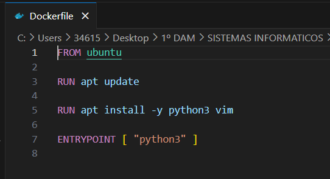

**¿Que significa este Dockerfile?**

Este Dockerfile define una imagen basada en **Ubuntu** con **Python 3** y **Vim** instalados. Vamos a desglosarlo línea por línea:

**`FROM ubuntu`**

- Especifica que la imagen base es **Ubuntu** (probablemente la última versión disponible en Docker Hub).

**`RUN apt update`**

- Ejecuta `apt update` para actualizar la lista de paquetes disponibles en el sistema.

**`RUN apt install -y python3 vim`**

- Instala **Python 3** y **Vim** sin pedir confirmación (`-y`).

**`ENTRYPOINT [ "python3" ]`**

- Define que, al ejecutar un contenedor basado en esta imagen, el comando predeterminado será `python3`.
- Esto significa que, si ejecutas el contenedor sin argumentos, entrarás directamente en el intérprete de Python.

**Ejemplo de uso:**

Si construimos la imagen con:

```bash
$docker build -t mi-imagen .
```

Y luego ejecutamos un contenedor con:

```bash
$docker run -it mi-imagen
```

Entraremos directamente en la consola interactiva de **Python 3**.

Si queremos ejecutar un script Python al iniciar el contenedor, deberemos ejecutar el siguiente comando:

```bash
$docker run mi-imagen script.py
```

Y ejecutará `python3 script.py` automáticamente.

Una vez explicado de manera muy rápida y sencilla que es un *Dockerfile,* volvamos a qué apartados podemos encontrar dentro de un "Build".

Cuando hacemos click en algún docker build de nuestra lista, nos aparecen diferentes secciones: ***"Info","Source","Logs" e "History".***

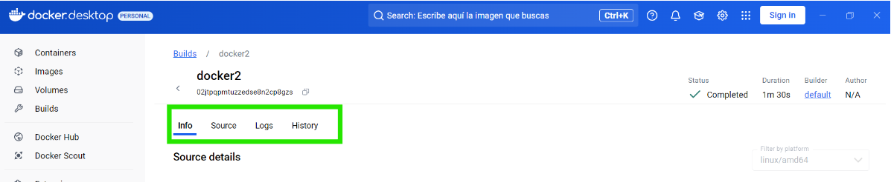

Sección <u>**Info**</u>:

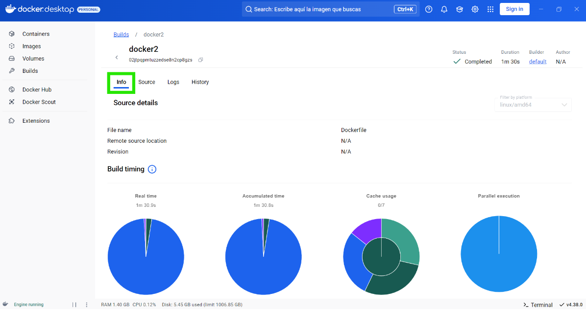

El apartado **Info** proporciona **información detallada** sobre el proceso de construcción de la imagen que estás realizando. Aquí puedes ver detalles sobre el contexto de construcción, las imágenes involucradas y otros parámetros relacionados.

**Funcionalidad**:

- **Contexto de construcción**: Muestra el directorio desde donde se está construyendo la imagen. Este contexto contiene el `Dockerfile` y los archivos necesarios que serán incluidos en la imagen.
- **Imágenes base**: Muestra la imagen base que se está utilizando para la construcción. Por ejemplo, si estás utilizando una imagen de Node.js como base, se mostrará aquí.
- **Tamaño de la imagen**: Al final del proceso de construcción, puedes ver el tamaño total de la nueva imagen creada.

Sección <u>**Source**</u>:

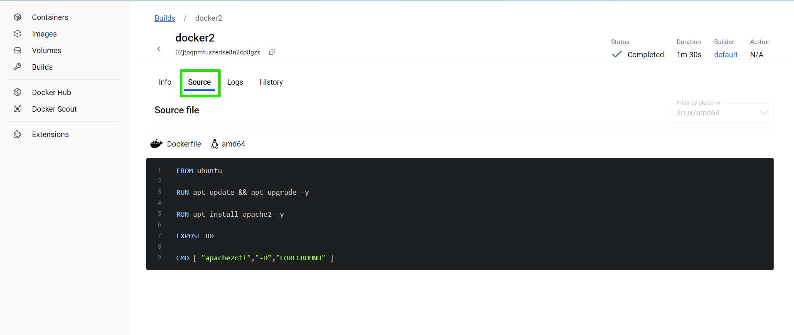

Te permite ver el **Dockerfile** que estás utilizando para crear la imagen, junto con los archivos que están siendo copiados al contenedor durante el proceso de construcción.

Sección <u>**Logs**</u>:

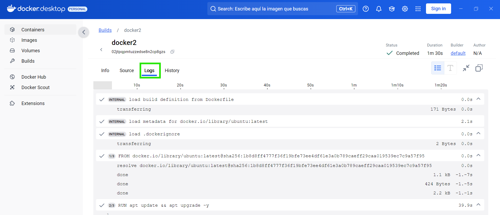


Muestra los **registros del proceso de construcción**. Aquí puedes ver qué está sucediendo durante el proceso de construcción de la imagen, incluidos los errores, advertencias y mensajes informativos generados por cada paso del `Dockerfile`.

**Funcionalidad**:

- **Ver mensajes detallados**: Cada paso del proceso de construcción es registrado aquí. Si un paso como `RUN npm install` falla, los logs te darán detalles sobre por qué falló.
- **Mensajes de error y advertencia**: Si hay algún problema durante la construcción (por ejemplo, una dependencia faltante o un comando erróneo), se mostrará en los logs.

Sección <u>**History**</u>:

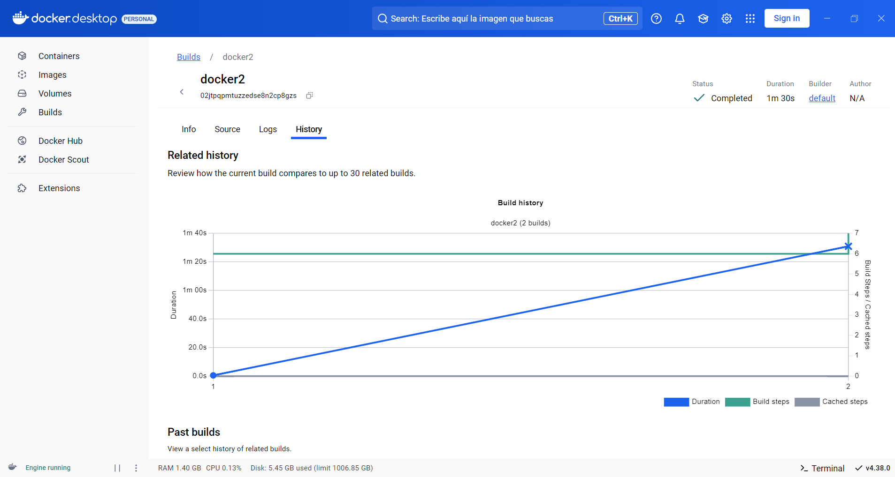

Te muestra el **historial de capas** de la imagen que estás construyendo. En Docker, las imágenes se construyen a partir de **capas** que corresponden a cada instrucción en el `Dockerfile` (por ejemplo, `FROM`, `RUN`, `COPY`). El historial te permite ver el detalle de todas las capas creadas durante la construcción de la imagen.

**Funcionalidad**:

- **Visualizar capas de la imagen**: Cada paso de tu `Dockerfile` genera una nueva capa en la imagen. Aquí podrás ver estas capas y cómo cada una contribuye al tamaño final de la imagen.
- **Detalles sobre cada capa**: Puedes ver detalles sobre cada capa, como el comando que se ejecutó para crearla, su tamaño y cuándo fue creada.
- **Optimización de imágenes**: El historial te permite ver cómo se construye la imagen y si hay pasos innecesarios o redundantes que pueden ser optimizados.

#### **3.6.** **Networks (Redes)**

Docker permite crear **redes virtuales** para que los contenedores se comuniquen entre sí. Desde aquí puedes:

- **Gestionar redes**: Crear, ver y eliminar redes personalizadas, como redes de puente (`bridge`) o redes de contenedor a contenedor.

#### **3.7.** **Extensions (Extensiones)**

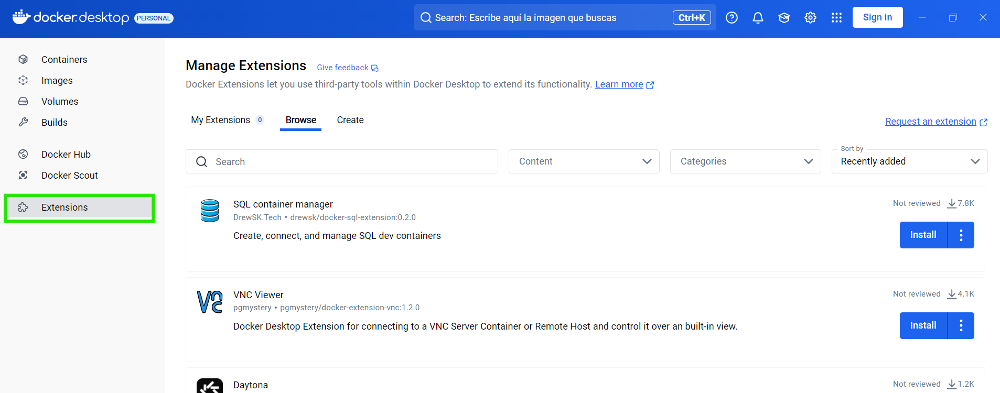

Las **extensiones** son aplicaciones y herramientas adicionales que puedes instalar dentro de Docker Desktop para mejorar o ampliar sus funcionalidades. Algunas extensiones son proporcionadas por Docker, mientras que otras provienen de la comunidad o de desarrolladores externos.

Estas extensiones pueden ayudarte a realizar **tareas específicas**, como:

- Monitorización de contenedores y aplicaciones.
- Gestión avanzada de redes y volúmenes.
- Integración con servicios de nube.
- Herramientas para desarrollo y pruebas.

#### **3.8.** **Settings (Configuración)**

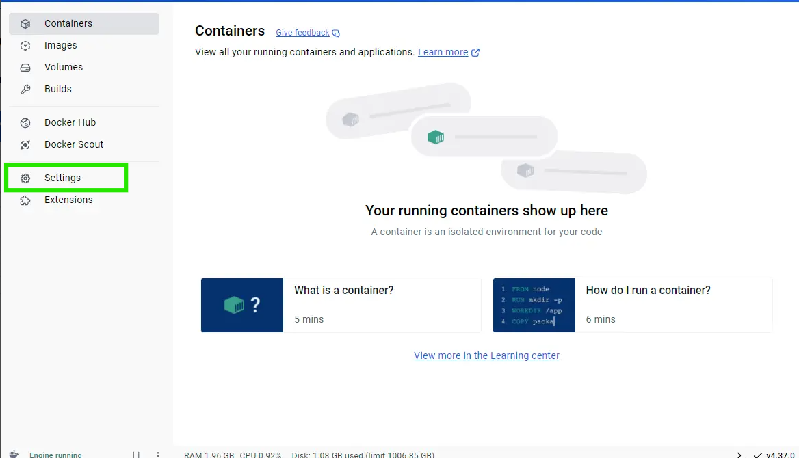

Aquí puedes ajustar varias configuraciones de Docker Desktop, tales como:

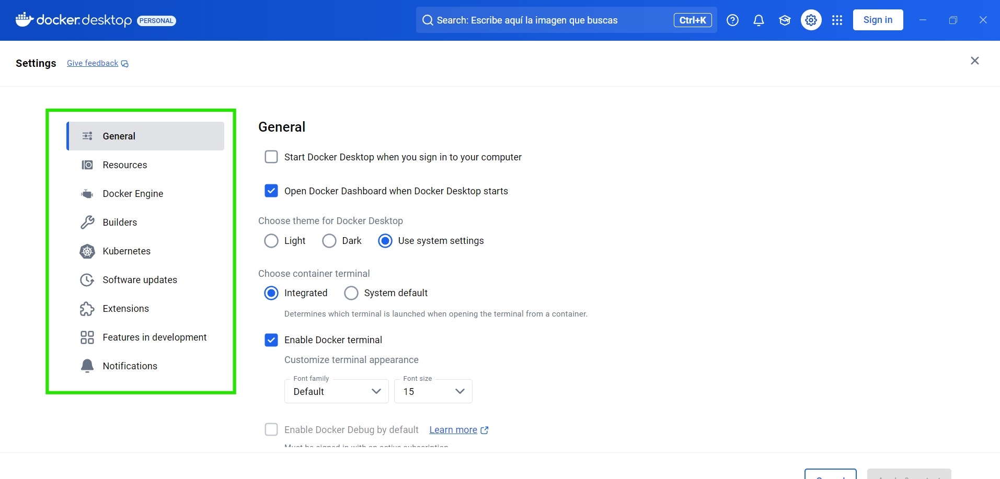

##### **3.8.1**.**General**

En **Docker Desktop** dentro de **Settings > General**, puedes configurar varias opciones clave para el comportamiento general de Docker. A continuación, os muestro un pequeño resumen de las más importantes:

- **Open Docker Dashboard when Docker Desktop starts** → Configura si el Dashboard se abre automáticamente al iniciar Docker Desktop.

- **Choose container terminal** → Selecciona qué terminal se usará al abrir un contenedor.

​            - **Integrated** → Usa el terminal integrado en Docker Desktop.

​            - **System default** → Usa el terminal del sistema (cmd, PowerShell, etc.).

- **Enable Docker terminal** → Activa el terminal de Docker dentro de la aplicación.

- **Customize terminal appearance** → Personaliza la apariencia del terminal:

​             - **Font family** → Tipo de fuente.

​              - **Font size** → Tamaño de fuente (predeterminado: 15).

- **Enable Docker Debug by default** → Activa el modo de depuración de Docker por defecto.

- **Expose daemon on tcp://localhost:2375 without TLS** → Expone el daemon de Docker sin TLS (⚠️ riesgo de seguridad).

- **Use the WSL 2 based engine (Windows only)** → Usa WSL 2 en lugar de Hyper-V en Windows.

- **Add the \*.docker.internal names to the host's /etc/hosts file** → Permite resolver los nombres de dominio **.docker.internal** desde el host y los contenedores.

- **Use containerd for pulling and storing images** → Usa **containerd** en lugar de Docker Engine para manejar imágenes.

- **Send usage statistics** → Envía estadísticas de uso a Docker.

- **Use Enhanced Container Isolation** → Mejora la seguridad para prevenir que los contenedores accedan a la VM de Linux (requiere suscripción Business).

- **Show CLI hints** → Muestra sugerencias en la CLI al ejecutar comandos Docker.

- **Enable Scout image analysis** → Activa el análisis de imágenes con **Docker Scout**.

- **Enable background Scout SBOM indexing** → Inicia automáticamente el indexado **SBOM** de imágenes cuando se crean o inspeccionan.

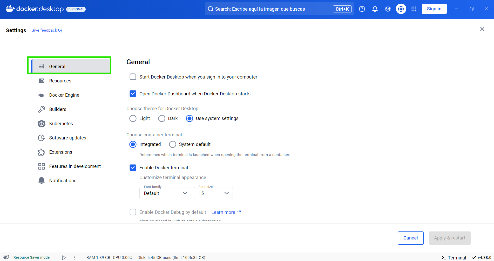

**¿Para qué sirve?**

La sección **General** te permite ajustar las preferencias básicas de **Docker Desktop**. Aquí puedes configurar las opciones relacionadas con el comportamiento general de la aplicación.

**Funcionalidad**:

- **Iniciar Docker al arrancar el sistema**: Puedes activar o desactivar la opción para que Docker se inicie automáticamente cuando arranques tu ordenador.
- **Modo oscuro**: Cambia entre el modo claro y oscuro para la interfaz de Docker Desktop.
- **Comportamiento del menú de la bandeja**: Configura cómo quieres que Docker se comporte cuando haces clic en el icono de la bandeja del sistema (por ejemplo, abrir el panel de Docker o mostrar el estado de Docker).
- **Restaurar ajustes por defecto**: Si en algún momento deseas devolver Docker a su configuración predeterminada, esta opción te permite hacerlo.

##### **3.8.2. Resources (Recursos)**

Esta sección permite gestionar y ajustar cómo Docker usa los recursos del sistema, como CPU, memoria y disco, así como configuraciones avanzadas relacionadas con red y proxies.

1. **CPU**: Configura el número de núcleos de CPU que Docker puede utilizar para ejecutar contenedores. Puedes asignar un número específico de núcleos según las necesidades de tus cargas de trabajo.
2. **Memory**: Ajusta la cantidad de **memoria RAM** disponible para Docker. Esto permite asignar más o menos memoria a los contenedores según lo que se requiera para tu proyecto.
3. **Swap**: Define el espacio de **swap** (memoria virtual) para que Docker lo use cuando la memoria RAM se agote. Puedes especificar el tamaño máximo de swap.
4. **Disk image location**: Configura la ubicación del disco donde Docker almacena las imágenes y contenedores. Puedes cambiar esta ubicación si es necesario para optimizar el uso del espacio en tu disco duro.
5. **File sharing**: Permite compartir carpetas entre el host (tu máquina) y los contenedores. Aquí puedes gestionar qué carpetas se pueden acceder desde dentro de los contenedores.

**Sub-secciones dentro de Resources**:

1. **Advanced**:
   Configura opciones avanzadas como la cantidad de **CPU**, **memoria RAM** y **swap** para optimizar el rendimiento de Docker según las necesidades específicas de tu máquina y los proyectos.
2. **Proxies**:
   Aquí puedes configurar un **proxy** si tu red requiere uno para acceder a internet. Esto es común en entornos corporativos o redes restringidas, donde Docker necesita acceder a recursos externos como **Docker Hub** a través de un proxy.
3. **Network**:
   Gestiona las opciones de red avanzadas. Aquí puedes configurar aspectos como el **DNS** para los contenedores y cómo Docker maneja las redes entre contenedores y entre el host y los contenedores.
4. **WSL Integration**:
   Esta opción está disponible para usuarios de **Windows** y permite configurar la **integración con WSL 2** (Windows Subsystem for Linux 2). Puedes habilitar o deshabilitar la integración de Docker con distribuciones de Linux instaladas en WSL 2 y seleccionar qué distribuciones pueden usar Docker para ejecutar contenedores.

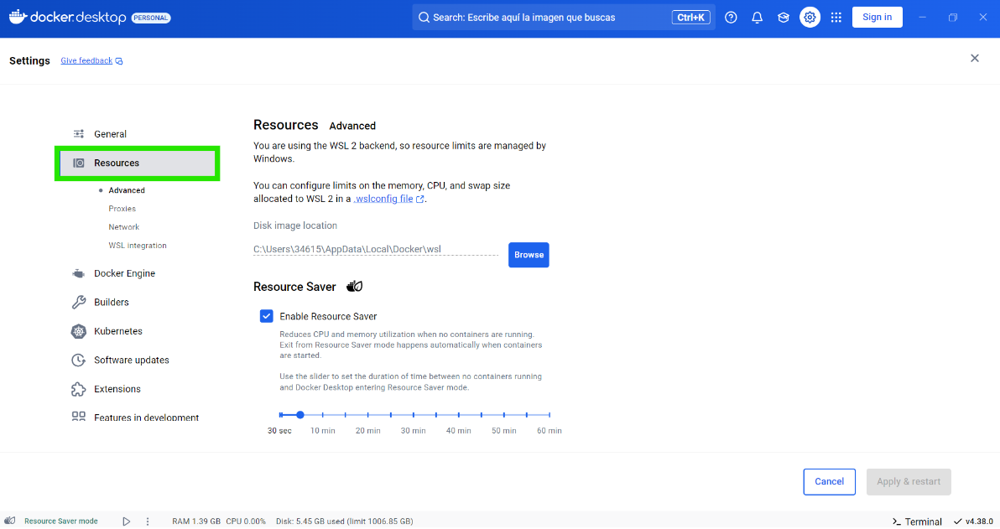

**¿Para qué sirve?**

En la sección **Resources**, puedes configurar la cantidad de recursos del sistema que Docker usará, como la CPU, la memoria RAM y el espacio en disco. Esto es especialmente importante cuando trabajas con contenedores que requieren más recursos o si tienes un sistema con capacidades limitadas.

**Funcionalidad**:

- **CPU**: Puedes asignar el número de **núcleos de CPU** que Docker puede utilizar. Si tienes un sistema con múltiples núcleos, puedes asignar más para mejorar el rendimiento de los contenedores, especialmente si estás ejecutando aplicaciones pesadas.
- **Memoria (RAM)**: Permite configurar la cantidad de **memoria RAM** que Docker puede utilizar. Si tus contenedores están experimentando problemas de rendimiento por falta de memoria, puedes aumentar esta cantidad.
- **Swap**: Docker usa **swap** (memoria virtual) cuando la memoria RAM está llena. Puedes ajustar el tamaño del swap para mejorar el manejo de memoria.
- **Disco**: Configura el espacio en disco que Docker puede usar para almacenar imágenes, contenedores y otros datos. Si estás trabajando con muchos contenedores o imágenes grandes, puede que necesites ajustar este valor.
- **Red**: Docker te permite configurar cómo usa la red en tu sistema. Aquí puedes ajustar aspectos como el **puerto de Docker**, la configuración de redes, etc.

##### **3.8.3. Docker Engine**

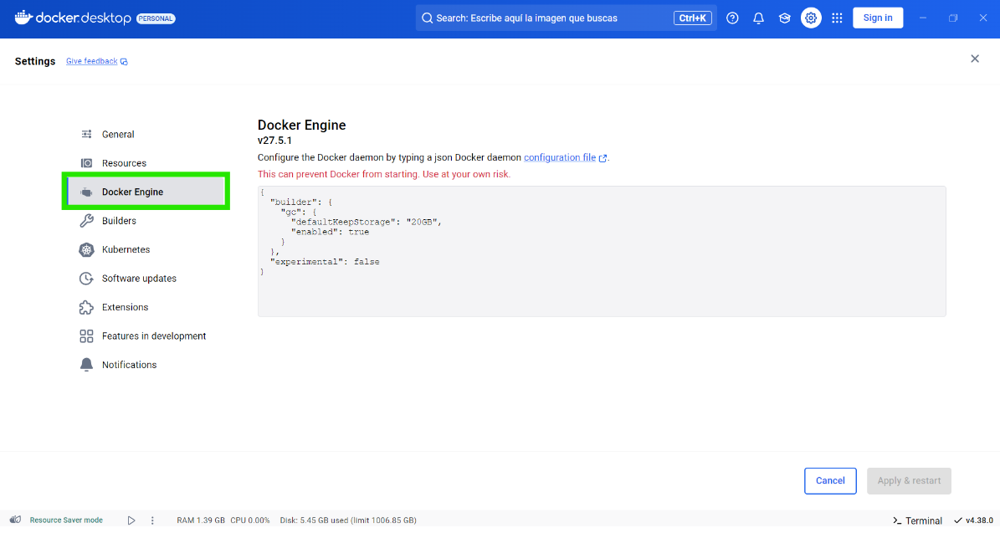

**¿Para qué sirve?**

En la sección **Docker Engine**, puedes configurar directamente los parámetros del motor Docker utilizando un archivo de configuración JSON. Esto te permite personalizar aún más la forma en que Docker opera en tu máquina.

**Funcionalidad**:

- **Configuración avanzada**: Puedes editar la configuración del motor Docker directamente, modificando parámetros como la cantidad de memoria compartida, las opciones de registro o la dirección de escucha del *Docker Daemon*.*
- **Contenedores predeterminados**: Puedes personalizar las opciones relacionadas con cómo se deben crear o ejecutar los contenedores.
- **Inicio de Docker**: Puedes configurar qué tipo de comportamiento debe tener Docker al iniciar (por ejemplo, si debe intentar reiniciar los contenedores automáticamente).

*Un Docker Daemon, (dockerd) es el proceso en segundo plano que gestiona todas las operaciones de Docker en el sistema. Se encarga de crear, ejecutar y supervisar contenedores, gestionar imágenes, manejar redes y volúmenes, y comunicarse con repositorios de imágenes. También expone una API para interactuar con el **Docker Client**, que es el que envía las instrucciones al daemon. En resumen, el Docker Daemon es el "motor" que ejecuta y coordina todas las acciones relacionadas con contenedores en nuestra máquina.

##### **3.8.4. Kubernetes**

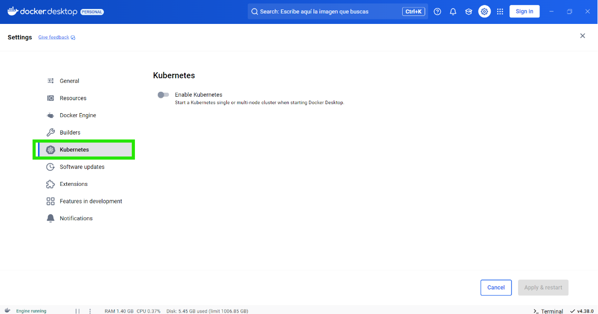

**¿Para qué sirve?**

Docker Desktop viene con la opción de integrar **Kubernetes** (un sistema de orquestación de contenedores) directamente. En esta sección, puedes configurar y gestionar Kubernetes dentro de Docker Desktop.

**Funcionalidad**:

- **Habilitar o deshabilitar Kubernetes**: Si no necesitas Kubernetes en tu proyecto, puedes desactivarlo desde esta sección. Si trabajas con aplicaciones de **microservicios** o en un **entorno de producción**, Kubernetes puede ser útil para la orquestación de contenedores.
- **Configurar el clúster**: Si decides habilitar Kubernetes, Docker Desktop te permite **configurar tu clúster Kubernetes** localmente para pruebas y desarrollo.
- **Borrar el clúster**: Si ya no necesitas el clúster de Kubernetes, puedes eliminarlo y liberar los recursos que estaba utilizando.

##### **3.8.5. Extensions (Extensiones)**

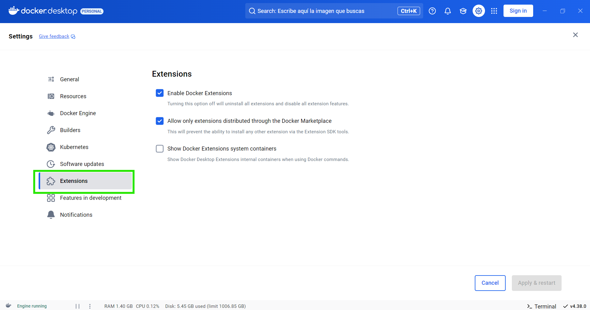

**¿Para qué sirve?**

Esta sección te permite gestionar las **extensiones** que puedes instalar para ampliar las funcionalidades de Docker Desktop.

**Funcionalidad**:

- **Explorar e instalar extensiones**: Puedes ver qué extensiones están disponibles, instalarlas y configurarlas para ampliar las funcionalidades de Docker Desktop. Algunas de las extensiones populares incluyen herramientas para monitoreo, integración con Kubernetes y servicios en la nube, entre otras.
- **Gestionar las extensiones**: Puedes ver las extensiones instaladas, actualizarlas o eliminarlas según tus necesidades.

##### **3.8.6. Updates (Actualizaciones)**

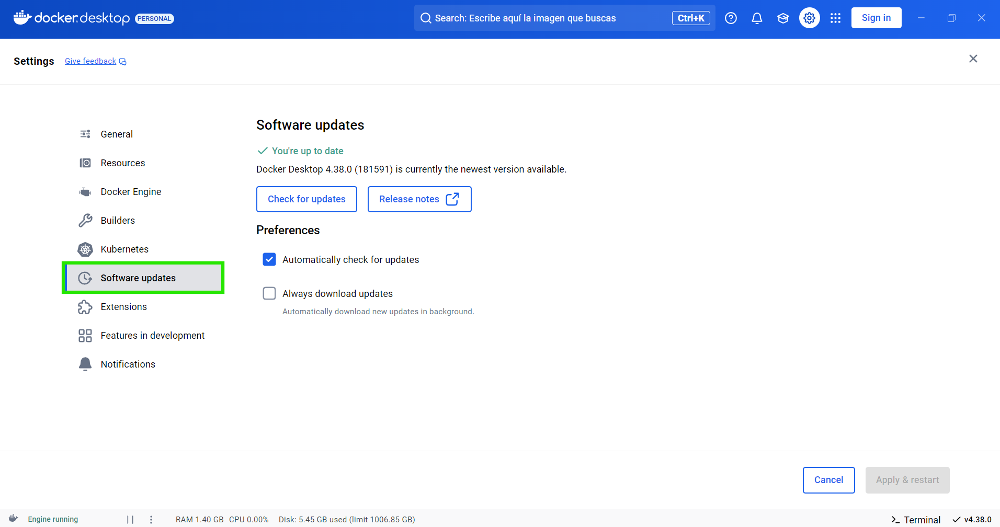

**¿Para qué sirve?**

Esta sección nos permite gestionar las **actualizaciones** de Docker Desktop.

**Funcionalidad**:

- **Verificar actualizaciones**: Docker Desktop verifica automáticamente si hay actualizaciones disponibles y te notifica si tienes una nueva versión.
- **Configurar actualizaciones automáticas**: Puedes activar o desactivar las actualizaciones automáticas de Docker, lo que es útil si prefieres controlar cuándo realizar las actualizaciones.
- **Historial de actualizaciones**: Puedes ver un historial de las versiones de Docker que has instalado previamente.

##### **3.8.7. Troubleshoot (Solucionar problemas)**

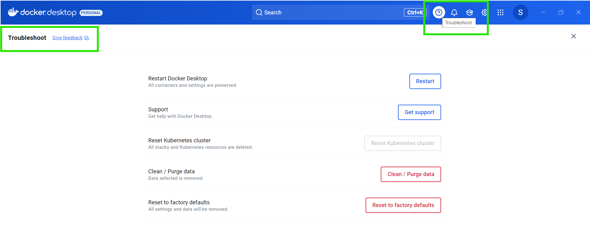

**¿Para qué sirve?**

La sección **Troubleshoot** nos ayuda a diagnosticar problemas y errores en Docker Desktop.

**Funcionalidad**:

- **Reiniciar Docker**: Si Docker no está funcionando correctamente, puedes reiniciarlo desde esta sección para solucionar problemas temporales.
- **Diagnóstico**: Docker Desktop incluye una herramienta de diagnóstico que analiza el estado de la aplicación y te proporciona información útil para resolver problemas.
- **Reiniciar configuraciones**: Si Docker está experimentando problemas graves, puedes **restaurar los ajustes de fábrica** o **borrar datos** para empezar de nuevo sin perder configuraciones importantes.

##### **3.8.8. Experimental Features (Funciones Experimentales)**

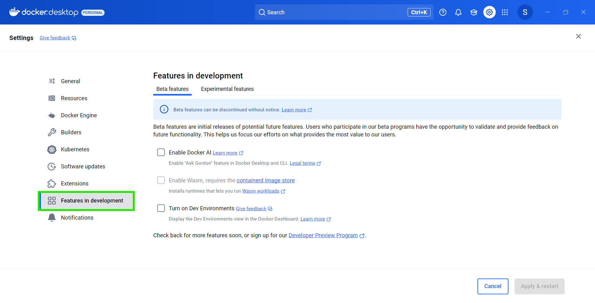

**¿Para qué sirve?**

En esta sección, puedes activar o desactivar las **funciones experimentales** de Docker.

**Funcionalidad**:

- **Activar características beta**: Algunas funciones de Docker están en versión beta o experimental. Si activas esta opción, puedes probar características nuevas que aún no están completamente disponibles para todos los usuarios.
- **Personalización avanzada**: Las características experimentales pueden proporcionar nuevas capacidades, pero no siempre están completamente pulidas.

## **4. Otras áreas y secciones:**

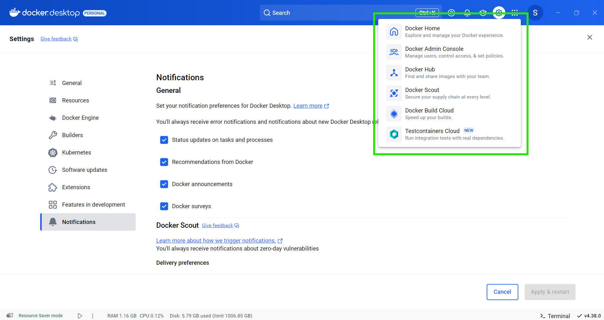

#### **4.1. Docker Home**:

Es la pantalla principal de Docker Desktop, donde podemos ver el estado general de Docker, gestionar contenedores, imágenes y redes, así como acceder a las configuraciones y herramientas.


#### **4.2. Docker Admin Console**: 

Un panel administrativo para gestionar configuraciones avanzadas, usuarios y recursos de Docker en tu máquina o entorno de trabajo.

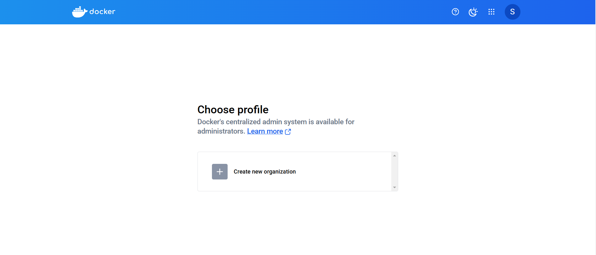

#### **4.3. Docker Hub**:

 La plataforma de almacenamiento y distribución de imágenes Docker, donde podemos buscar, descargar o subir imágenes oficiales o personalizadas.

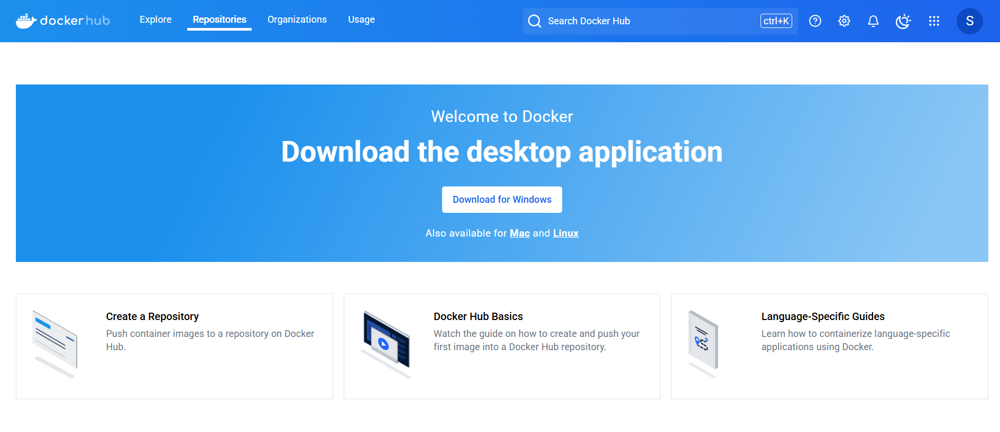

#### **4.4. Docker Scout**: 

Herramienta que analiza imágenes Docker en busca de vulnerabilidades, dependencias y otros problemas de seguridad.

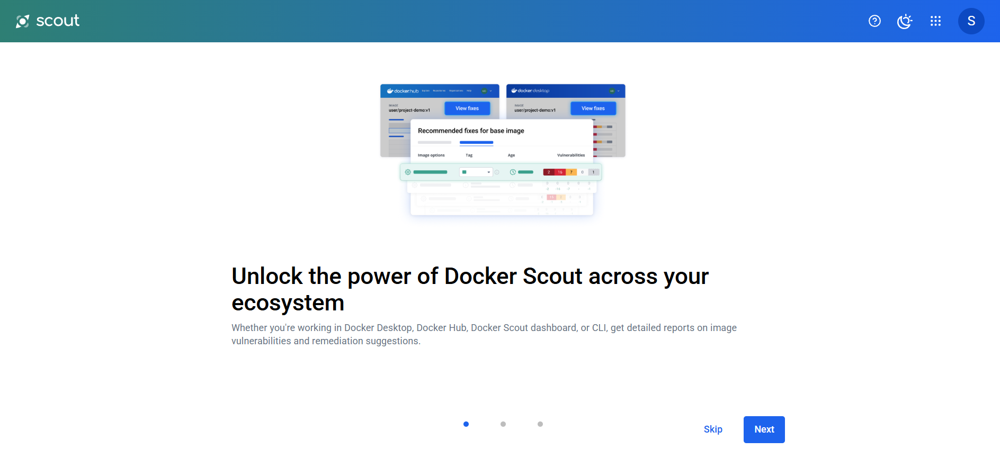

#### **4.5. Docker Build Cloud**: 

Funcionalidad que permite construir imágenes Docker en la nube, optimizando recursos y mejorando el rendimiento de la construcción de contenedores.

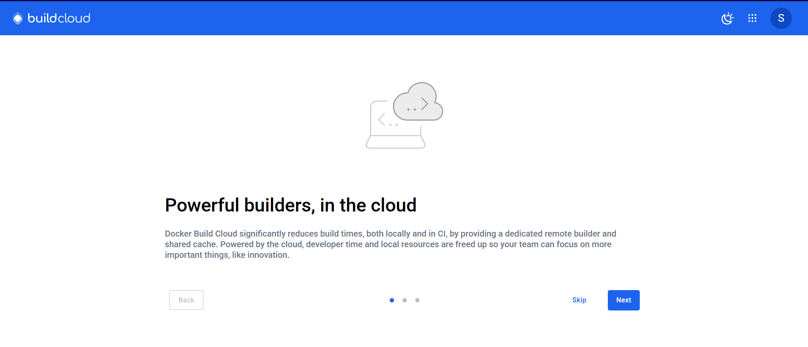

#### **4.6. Testcontainers Cloud**: 

Servicio que permite ejecutar pruebas automatizadas de contenedores en la nube, especialmente útil para pruebas de integración con contenedores de bases de datos u otros servicios.

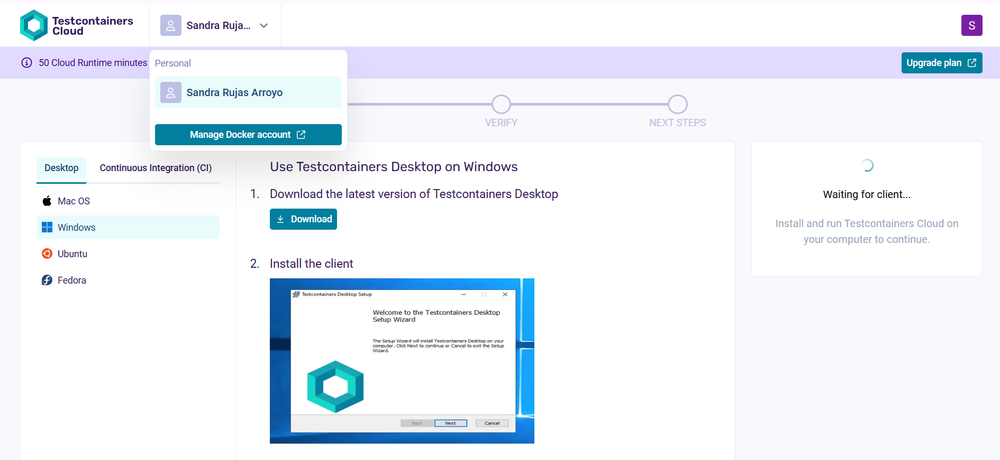

## **5. Resumen final de las funcionalidades clave de Docker Desktop**

#### **5.1. Descargar e instalar Docker Desktop**

- **En Windows o macOS**, podemos descargar Docker Desktop desde el sitio web oficial de Docker, tan sólo debemos seguir los pasos del asisten de instalación que nos proporcionan.

#### **5.2. Usar Docker Desktop**

Una vez que Docker Desktop esté instalado y en funcionamiento:

1. **Iniciamos Docker Desktop** desde el icono en la barra de tareas o en el dock (en macOS).
2. **Accedemos a las áreas de "Images", "Containers" y "Settings"**.
3. **Gestionamos contenedores, imágenes, volúmenes y redes** de manera visual, sin necesidad de usar comandos en la terminal.

#### **5.3. Configuración de recursos**

Deberemos asegurarnos de que Docker tenga suficientes recursos (CPU, RAM) para ejecutar nuestras aplicaciones. Puedes ajustarlo desde **Settings > Resources** (*sección explicada en el punto 3.8.2. Resources (Recursos)*).

#### **5.4. Crear y ejecutar contenedores**

- **Crear contenedores**: Con las imágenes descargadas, podemos crear contenedores para ejecutar aplicaciones o servicios.
- **Ejecutar contenedores**: Desde Docker Desktop, podemos iniciar contenedores directamente, sin necesidad de usar la línea de comandos, aunque la terminal sigue estando disponible para mayor flexibilidad.

#### **5.5. Docker Compose**

**Docker Compose** es una herramienta que permite definir y ejecutar aplicaciones con múltiples contenedores, generalmente usados para aplicaciones complejas. Podemos gestionar nuestras aplicaciones multi-contenedor usando archivos `docker-compose.yml` que describen los servicios.

#### **5.6. Terminal integrada**

Aunque la GUI de Docker Desktop es muy intuitiva, Docker también incluye una terminal integrada donde podemos ejecutar todos los comandos de Docker tradicionales:

- **docker run**: Crea un contenedor y lo ejecuta.
- **docker ps**: Muestra los contenedores activos.
- **docker build**: Construye imágenes a partir de un Dockerfile.
- **docker-compose up**: Levanta todos los servicios definidos en un archivo `docker-compose.yml`.

#### **5.7. Integración con Docker Hub**

Docker Desktop se integra con **Docker Hub** (el registro público de imágenes de Docker). Desde la GUI puedes:

- **Buscar imágenes** en Docker Hub.
- **Subir imágenes** que crees localmente para compartirlas o reutilizarlas en otros entornos.

#### **5.8. Docker Desktop en WSL 2 (Windows)**

En sistemas Windows, Docker Desktop usa **WSL 2** (Windows Subsystem for Linux) para ejecutar contenedores de manera eficiente. Esto mejora el rendimiento y permite una integración más fluida entre Windows y Linux. WSL 2 es especialmente útil para trabajar con aplicaciones basadas en Linux desde una máquina Windows.


> En resumen, Docker Desktop ofrece una plataforma poderosa y fácil de usar para desarrollar, gestionar y ejecutar contenedores en nuestra máquina local. Con herramientas como **Docker Home** para gestionar tus contenedores e imágenes, **Docker Hub** para acceder a un vasto repositorio de imágenes, y **Docker Scout** para mejorar la seguridad de tus proyectos, Docker Desktop facilita el flujo de trabajo de desarrollo y prueba. Además, con funcionalidades avanzadas como **Docker Build Cloud** y **Testcontainers Cloud**, puedes optimizar la construcción y prueba de contenedores en la nube. Docker Desktop no solo simplifica la administración de contenedores, sino que también nos brinda un entorno flexible y escalable para nuestros proyectos, ya sea en desarrollo local o en producción.


