# EJERCICIO 2 - SERVIDOR DE BASE DE DATOS

> Realizado por Andrea Gómez Fueyo y Sandra Rujas

### **EJERCICIO 2 - Servidor de base de datos**

Abre Docker Desktop. Busca mariadb en la sección de imágenes. Selecciona la imagen oficial. Descárgala si no la tienes.

- Si no puedes iniciar sesión, la imagen puedes descargarla mediante comandos.

```bash
docker pull mariadb:latest
```


- Si puedes acceder a la búsqueda de imagen, entras en *“Images”*, buscas la última de maridb y pulsas pull para descargarla.


- En la sección de imágenes, seleccionamos la que queremos utilizar, que en nuestro caso es la de mariadb, y pulsamos el botón de run:

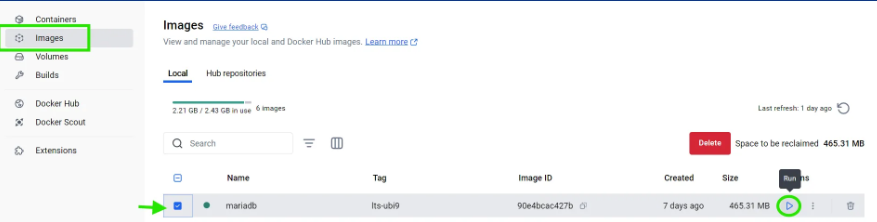

- Al darle al run, nos permite crear un nuevo contenedor:

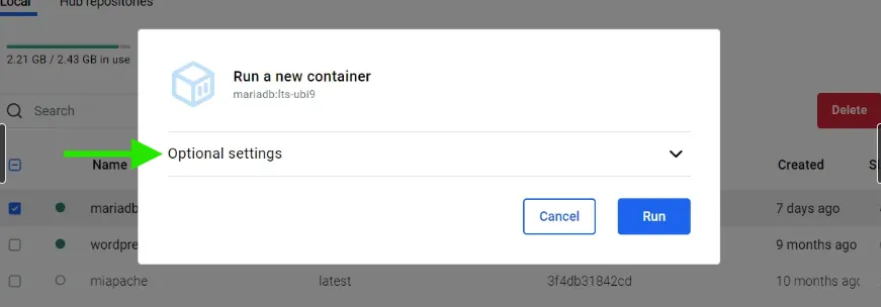


Al cual le tenemos que poner las siguientes **características**:

- **Nombre del contenedor:** bbdd .

- **Puerto:** 3306 - debe poder conectarse externamente

- Utiliza un **volumen** llamado datos-mariadb .

- Usa las **variables de entorno** necesarias para que el usuario root tenga la password root , la base de datos por defecto sea base , y se cree un usuario daw , con password daw.

  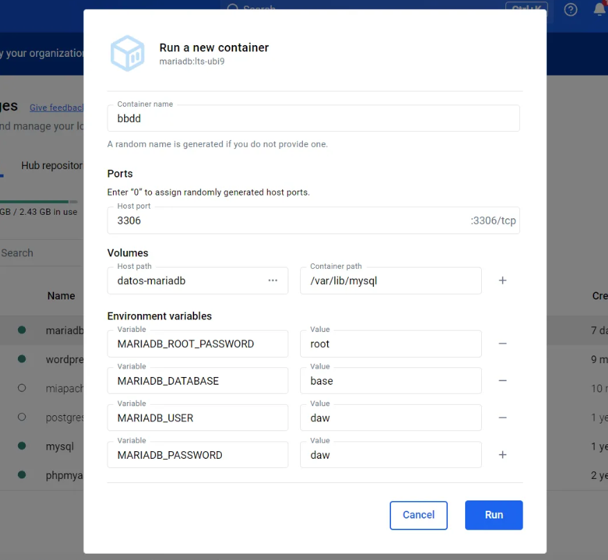

- Arrancamos el contenedor:

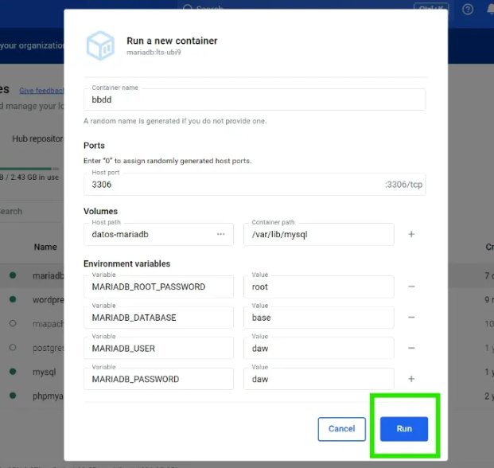

Una vez pulsado el RUN, nos vamos a la sección de contenedores para comprobar que finalmente se haya creado:

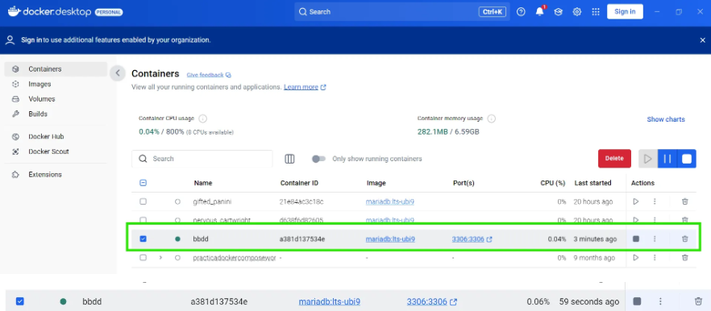

Accede a la base de datos usando una herramienta gráfica, como, por ejemplo dbeaver . Conéctate con el usuario daw . Crea una base de datos y alguna tabla.

- Abrimos **DBeaver** y crear una nueva conexión a MariaDB: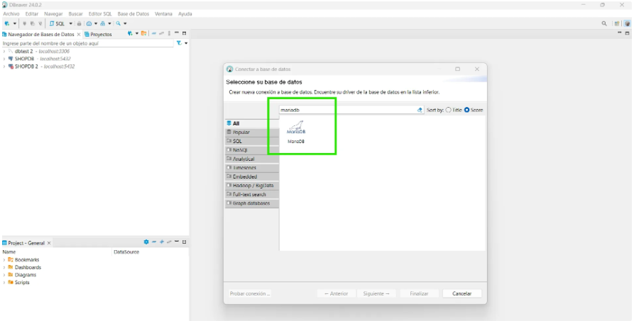

- Configuramos la conexión:

  - **Host:** `localhost`
  - **Puerto:** `3306`
  - **Usuario:** `daw`
  - **Contraseña:** `daw`
  - **Base de datos:** `base`

  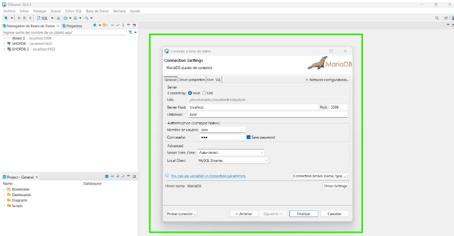

En la columna de la izquierda, podemos comprobar que se ha creado la conexión correctamente:

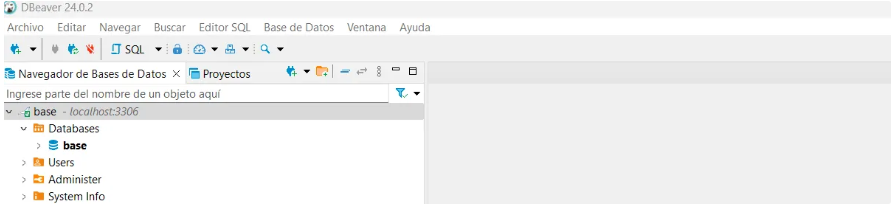

- Creamos una tabla:

Hacemos click en el botón derecho y pulsamos en “Crear Nueva Columna” para agregar datos:

En *Table Name* introducimos el nombre de la tabla que queramos, en nuestro caso hemos elegido: “usuario”.

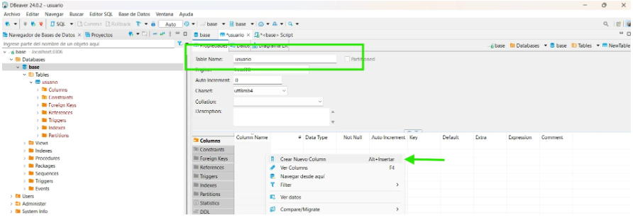

Después hemos creado las columnas para añadir los atributos a nuestra tabla:

- Un **id:** que es un INT, AUTO_INCREMENT y PK.

  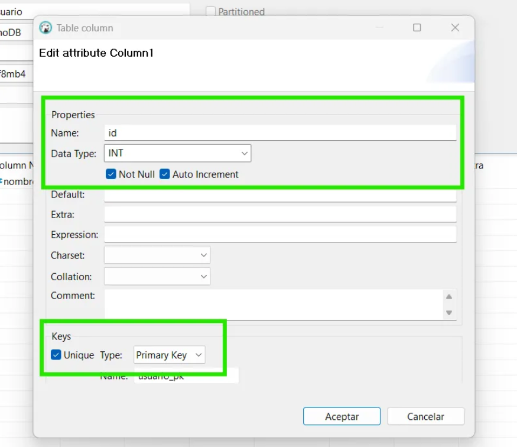

- Un **nombre**: que es un VARCHAR (25) y que no puede ser NULL.

  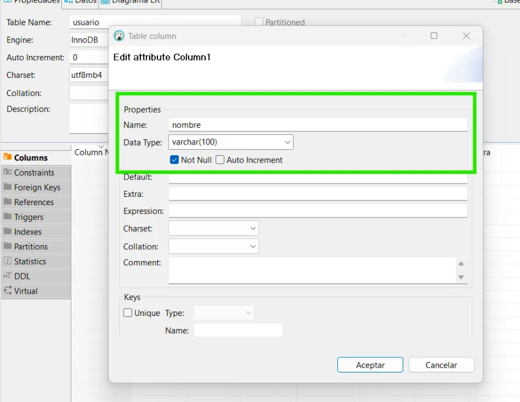

- Un **correo**: que es u VARCHAR de 50.

  

Comprobamos la creación de la tabla:


Una vez creada la tabla, intentamos borrar el contenedor:

- Vamos a la pestaña **"Containers"** y buscamos el contenedor bbdd:

  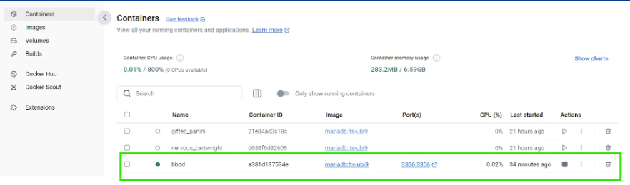

- Lo paramos y le damos a eliminar:

  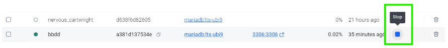

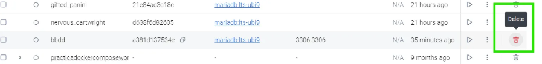

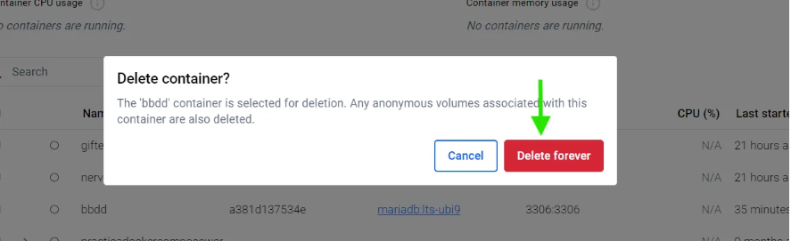

Vemos como en Docker Desktop el volumen que contiene los datos no se ha borrado:

- Vamos a la pestaña **"Volumes"** en Docker Desktop. Buscamos datos-mariadb y verificar que sigue ahí:

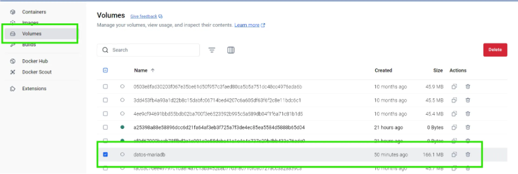


Creamos otro contenedor con un servidor de base de datos que use el mismo volumen:

- Llamamos al contenedor **bbdd-2** y utilizamos el mismo volumen que anteriormente:

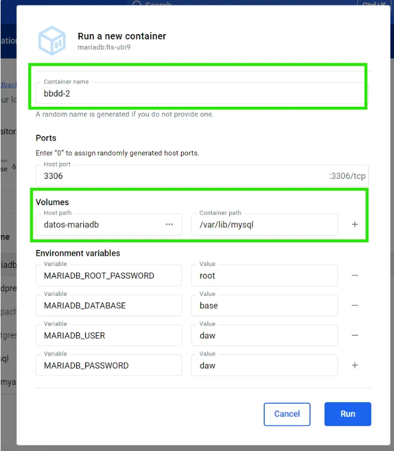

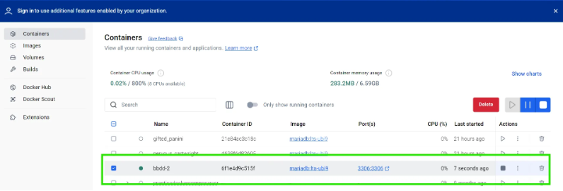

Volvemos a **DBeaver** y creamos una nueva conexión a bbdd-2:

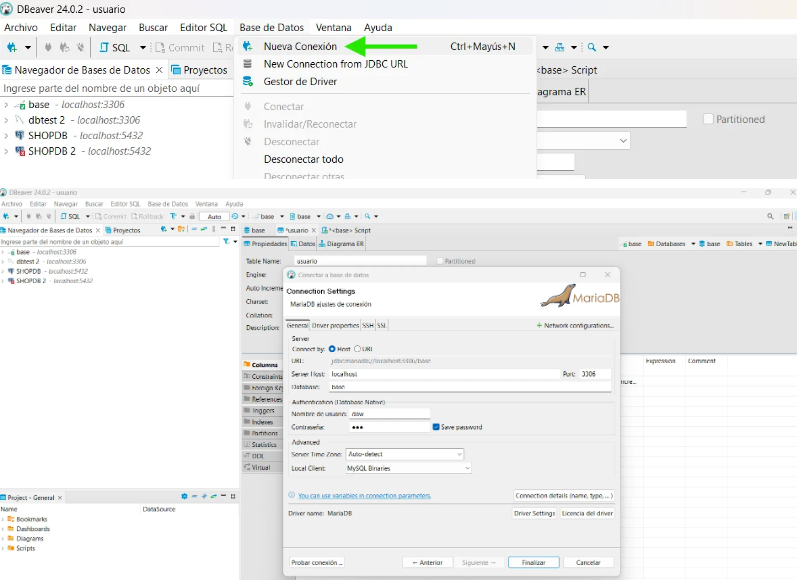

Tras darle al botón de ‘Finalizar’, en la columna de la izquierda, podemos comprobar, que efectivamente, se ha creado una nueva conexión, que mantiene los datos que hemos introducido en el ejercicio anterior, es decir, la tabla de **usuarios** con sus correspondientes **columnas**:

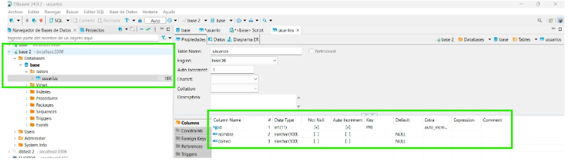

Seguidamente, vamos la pestaña de **“Images”** en Docker Desktop y buscamos mariadb e intentamos eliminarla:

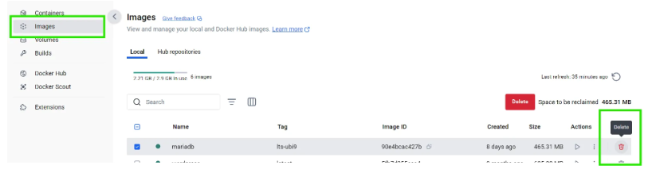

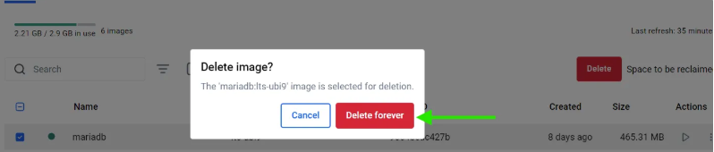

**¿Qué sucede?**

En este caso podemos comprobar que no es posible su eliminación porque hay un contenedor en ejecución.

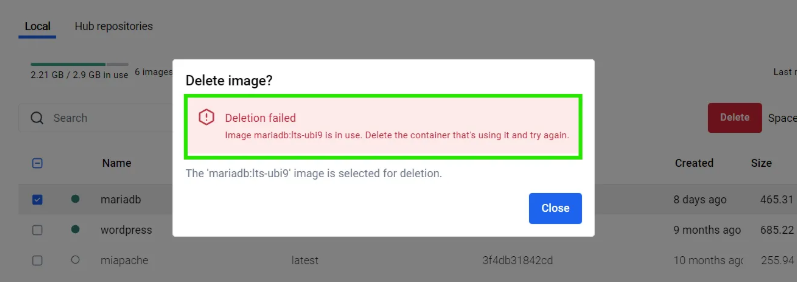

Borramos todo, volumen, imagen y contenedor.

- Eliminamos el contenedor `bbdd-2` en **Docker Desktop**:

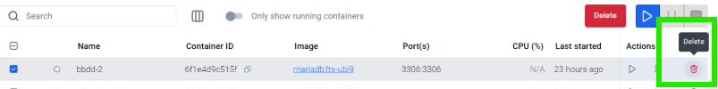


- Vamos a la pestaña **"Volumes"** y borramos`datos-mariadb:`
- Y por último vamos a **"Images"** y eliminamos `mariadb:`

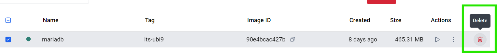

