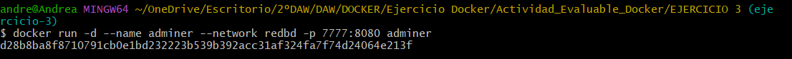

# Ejercicio 3 - contenedores en red: Adminer y MariaDB

La versión que tenemos instalada en nuestros ordenadores no cuenta con *Networks*, por lo que haremos esta tarea desde la terminal a través del uso de comandos.


1. **Crea una red bridge `redbd`.**

Creamos la red y comprobamos que se se creó correctamente.

```bash
$ docker network create redbd
$ docker network ls
```


2. **Crea un contenedor con una imagen de `mariaDB` que estará en la red `redbd` . Este contenedor se ejecutará en segundo plano, y será accesible a través del puerto 3306. (Es necesario definir la contraseña del usuario root y un volumen de datos persistente).**

Para crear el contenedor con imagen de `mariadb` en nuestra `redbd` tenemos que ejecutar el siguiente comando:

```bash
$ docker run -d --name mariadb_container --network redbd -p 3307:3306 -e MARIADB_ROOT_PASSWORD=root -e MARIADB_DATABASE=base -e MARIADB_USER=daw -e MARIADB_PASSWORD=daw -v datos-mariadb:/var/lib/mysql mariadb
```


- `d`: ejecuta el contenedor en segundo plano.
- `-name mariadb_container`: nombre del contenedor.
- `-network redbd`: conecta a la red `redbd` el contenedor .
- `p 3306:3306`: conecta el puerto **3306** del contenedor *mariadb* al puerto 3307 de nuestro ordenador.
- `e MARIADB_ROOT_PASSWORD=root`: contraseña de *root.*
- `e MARIADB_DATABASE=base`: crea la base de datos *base.*
- `e MARIADB_USER=daw` :  crea el usuario `daw` .
- `e MARIADB_PASSWORD=daw`: crea la contraseña `daw` al usuario `daw`.
- `v datos-mariadb:/var/lib/mysql`: usa el volumen `datos-mariadb` para guardar los datos del contenedor.

Una vez creado, comprobamos que está arrancado:

```bash
docker ps
```

-1740037943049-11.png)


3. **Crear un contenedor con *Adminer* o con *phpMyAdmin* que se pueda conectar al contenedor de la BD.**

Decidimos usar *Adminer,* ya que es una opción más ligera que *phpMyAdmin*, y creamos el contenedor con ese mismo nombre (*adminer).*



- **`docker run`**: Inicia un contenedor de Docker.
- **`-name adminer`**: Establece el nombre del contenedor como `adminer`. Esto facilita su gestión, ya que podrás referirte a él con ese nombre.
- **`-network redbd`**: conecta el contenedor de Adminer a la red Docker llamada `redbd`, pudiendo así Adminer comunicarse con otros contenedores en esa misma red.
- **`p 7777:8080`**: expone el puerto 8080 del contenedor (que es el puerto predeterminado de Adminer) al puerto 7777 en nuestra máquina local. Podremos acceder a Adminer en `http://localhost:7777`.
- **`d`**: ejecuta el contenedor en 2º plano.
- **`adminer`**: imagen que se usará para crear el contenedor, en este caso, la imagen oficial de Adminer, además, ponemos `adminer` como nombre de contenedor
- Una vez ejecutado, accedemos a *Adminer* desde nuestro navegador: http://localhost:7777


4. **Desde la interfaz gráfica, crear una base de datos y una tabla en el servidor de base de datos.**

Al acceder a *Adminer* desde nuestro navegador lo primero que debemos hacer es crear una base de datos, a la cual llamaremos `base`.


Una vez creada nuestra base de datos ya podemos crear una tabla, a la cual llamaremos `sandra_y_andrea`. Su creación es bastante sencilla e intuitiva.


Una vez creada, nuestra base de datos se ve la siguiente manera:


Ahora que vemos que todo funciona, ya podemos borrar los contenedores la red y los volúmenes utilizados.

```bash
$ docker container stop mariadb_container adminer 
$ docker container rm mariadb__container adminer    
$ docker volume rm datos-mariadb                             
$ docker network rm redbd                                   
```

Detener los contenedores:


Eliminar los contenedores:


Eliminar el volumen:


Eliminar la red:

