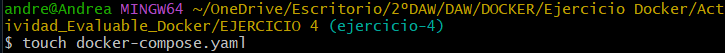
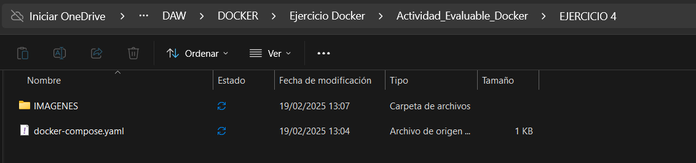
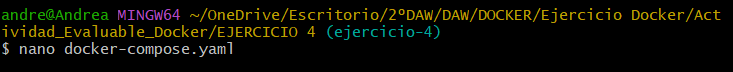
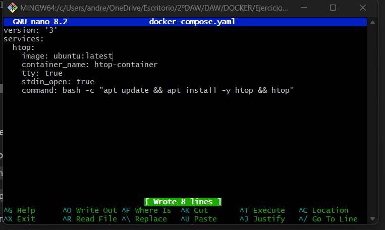
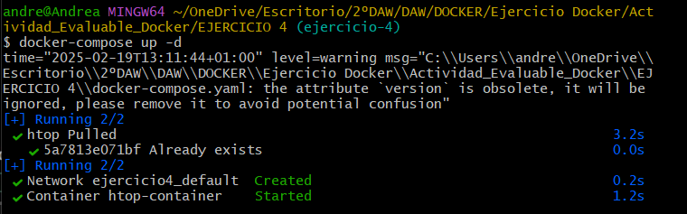
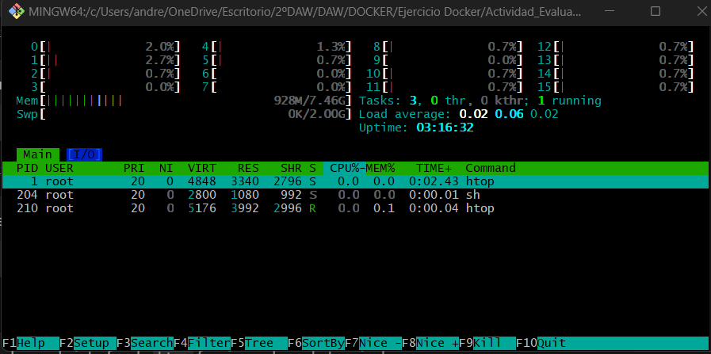

# Ejercicio 4 - Docker compose

En esta actividad se nos pide desplegar la aplicación htop utilizando docker-compose.

En primer lugar, creamos el archivo a través de comandos y comprobamos que se creó sin problema:





Una vez creado, lo editamos con el editor `nano`.

```bash
$ nano docker-compose.yaml
```



```bash
version: '3'
services:
  htop:
    image: ubuntu:latest
    container_name: htop-container
    tty: true
    stdin_open: true
    command: bash -c "apt update && apt install -y htop && htop"

```



Para levantar el contenedor usamos el comando `docker-compose up -d`, abriendo el terminal en dicho archivo, siendo el `docker-compose` para gestionar varios contenedores y `up` para iniciarlos siendo `-d` para ejecutarlos en segundo plano.

```bash
$ docker-compose up -d
```



Ahora es hora de poner en marcha el contenedor y verlo en acción. Para ello lo primero que hacemos es acceder a él a través del siguiente comando:

```bash
$ docker exec -it htop-container sh
# htop
```

Esto nos permite ver una interfaz de `htop` funcionando dentro de nuestro contenedor.



Una vez terminado el ejercicio ya podemos detener y eliminar el contenedor si así lo queremos:

```bash
$ docker-compose down
```

