# Ejercicio 5 - imagen con Dockerfile

En este apartado se nos pide arrancar un contenedor que ejecute una instancia de la imagen php:7.4-apache , que se llame web y que sea accesible desde un navegador en el puerto 8000, en nuestro caso, 8800.

```bash
docker run -d --name web -p 8800:80 php:7.4-apache
```

Creamos el sitio web y, una vez creado, hacemos lo mismo con el index, hoja de estilos y el script PHP.

```bash
mkdir web_andreaysandra
cd web_andreaysandra
```

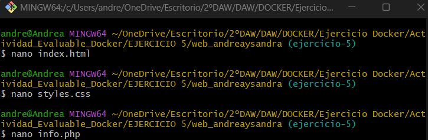

Creamos index.html y lo editamos:

```bash
nano index.html
<!DOCTYPE html>
<html lang="es">
<head>
    <meta charset="UTF-8">
    <meta name="viewport" content="width=device-width, initial-scale=1.0">
    <title>Probando PHP</title>
    <link rel="stylesheet" href="styles.css">
</head>
<body>
    <h1>Bienvenidos a nuestra WEB</h1>
    <form action="script.php" method="post">
        <h2>Hola, somos Sandra y Andrea</h2>
        <p>Somos estudiantes de 2º de DAW y estamos probando nuestra página usa>
</body>
</html>
```

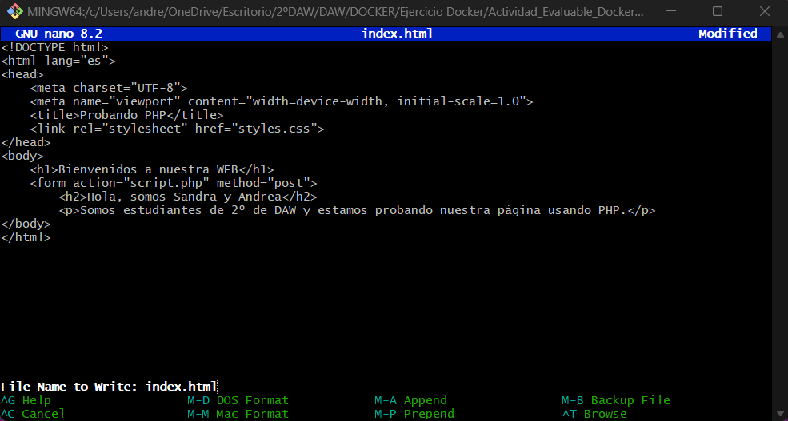

Ahora creamos el css:

```bash
nano styles.css
body {
    font-family: Arial, sans-serif;
    background-color: #7d2181;
    text-align: center;
    margin: 0;
    padding: 0;
}

h1 {
    color: black;
    margin-top: 20px;
}

p {
    font-size: 18px;
    color: #555;
    background: black;
    padding: 10px;
    border-radius: 8px;
    display: inline-block;
```

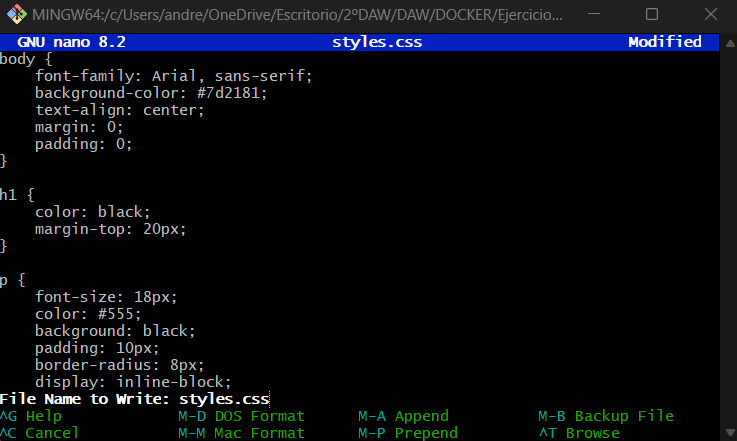

Y, finalmente, el script PHP:

```bash
nano info.php
<?php
setlocale(LC_TIME, "es_ES.UTF-8");
$mes_actual = strftime("%B");
$fecha_actual = date("d/m/Y");
$hora_actual = date("H:i:s");
echo "<h1>Información</h1>";
echo "<p>Hoy es $fecha_actual</p>";
echo "<p>El mes es: <strong>$mes_actual</strong></p>";
echo "<p>Hora: $hora_actual</p>";
?>
```

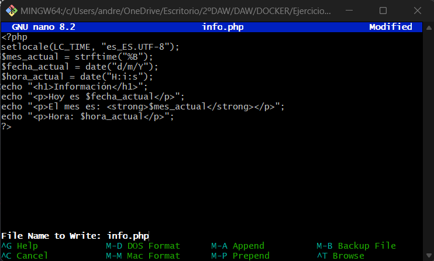

Una vez creados, copiamos los archivos en el contenedor, paso que hay que repetir cada vez que se modifique uno de ellos:

```bash
docker cp index.html web:/var/www/html/
docker cp styles.css web:/var/www/html/
docker cp info.php web:/var/www/html/
```

-1740053457780-5.png)

Una vez realizados estos pasos, es hora de comprobar en el navegador que se están aplicando correctamente. Visitamos http://localhost:8800/ y http://localhost:8800/info.php.

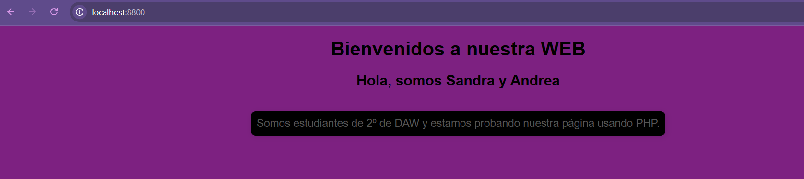

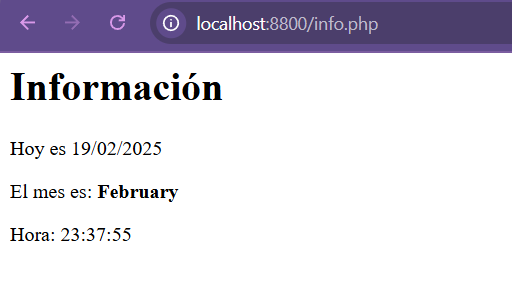

Ahora vamos a proceder con la automatización en Docker. Para subir la imagen a la cuenta de Docker hay que crear un fichero Dockerfile y editarlo.

```bash
$ touch Dockerfile
$ nano Dockerfile
```

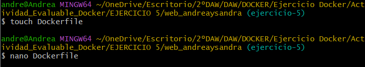

```bash
# Utiliza la imagen oficial de PHP con Apache como base
FROM php:7.4-apache

# Copia los archivos al contenedor
COPY index.html /var/www/html/
COPY styles.css /var/www/html/
COPY info.php /var/www/html/

# Expone el puerto 8000 para acceder al contenedor
EXPOSE 8000

# Configura Apache para escuchar en el puerto 8000
CMD ["apache2-foreground"]
```

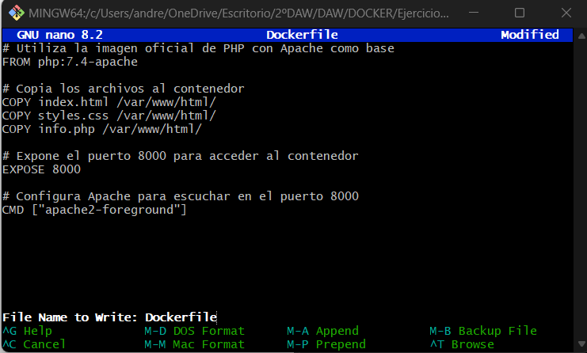

Una vez creado y editado, ya podemos crear la imagen.

```bash
$ docker build -t web_andreaysandra .
```

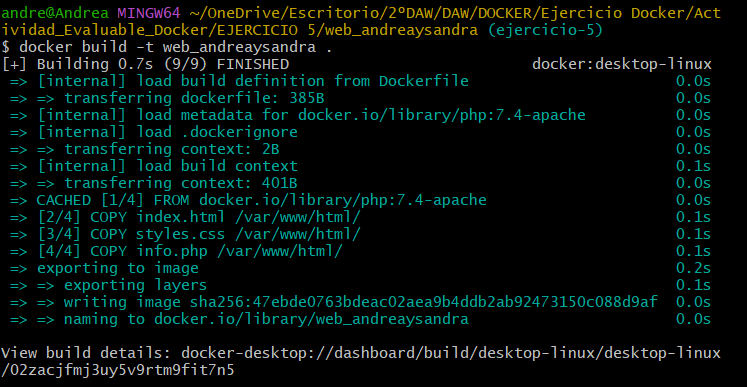

Con la imagen ya creada y automatizada, podemos ejecutar nuestros propios contenedores:

```bash
$ docker run -d --name web_andrea -p 8800:80 web_andreaysandra
```

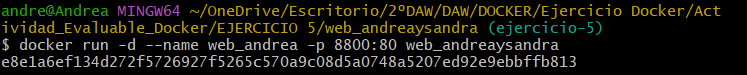

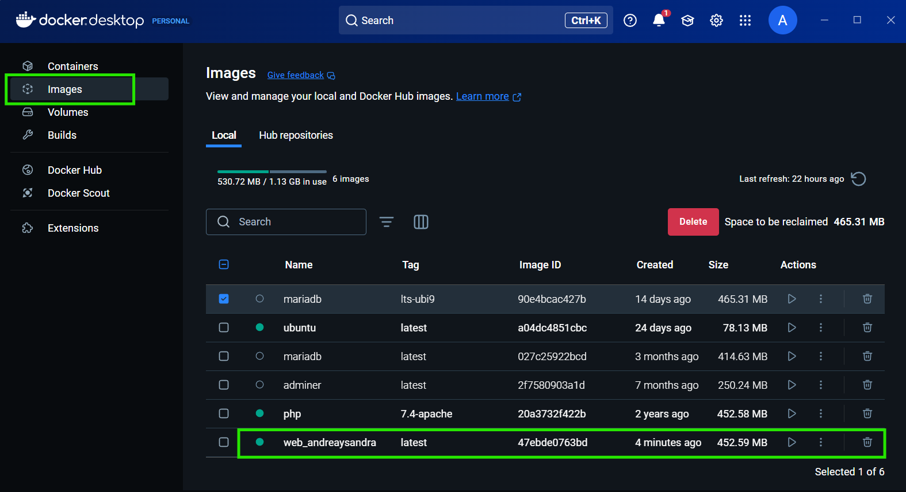