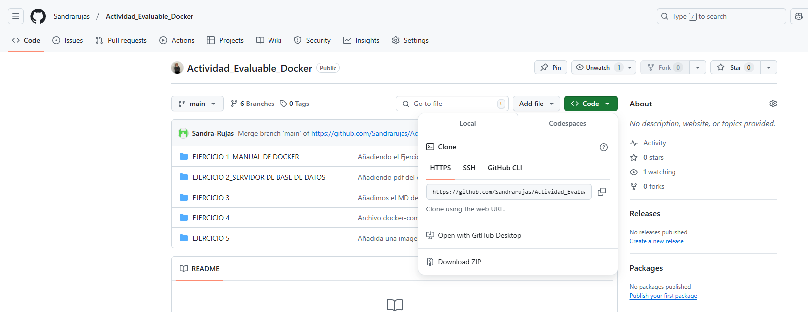
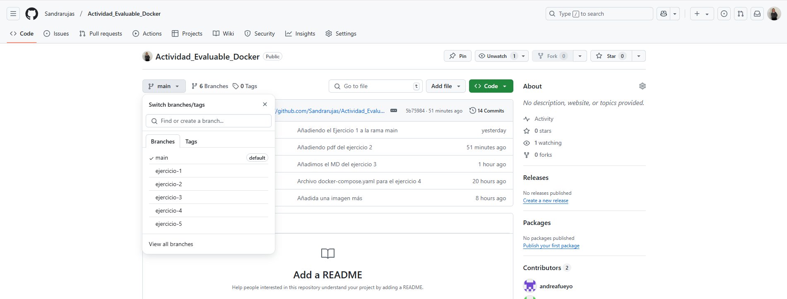

# 	ACTIVIDAD EVALUABLE DE DOCKER

[TOC]

### - **Enlace al repositorio**.

En el siguiente enlace encontrarás el repositorio de Github donde se encuentran los diferentes ejercicios:

https://github.com/Sandrarujas/Actividad_Evaluable_Docker.git 

### - **Integrantes.**

El grupo está formado por **Andrea Gómez Fueyo** y **Sandra Rujas Arroyo**. En este caso, el jefe de equipo ha sido Sandra Rujas. 

### - **Ramas.**

Para el desarrollo de este ejercicio, hemos utilizado seis ramas diferentes, una rama por ejercicio:

- **Rama** **Main**: nuestra rama principal. Dentro de esta rama encontrarás el conjunto de ejercicios al completo.
- **Rama** **"ejercicio-1":** rama que contiene el ejercicio 1 completo. Dentro de esta rama encontrarás una carpeta con las imágenes, una un documento `.md` y `.pdf` con el contenido de la actividad.
- **Rama** **"ejercicio-2":** rama que contiene el ejercicio 2 completo. Dentro de esta rama encontrarás una carpeta con las imágenes, una un documento `.md` y `.pdf` con el contenido de la actividad.
- **Rama** **"ejercicio-3":** rama que contiene el ejercicio 3 completo. Dentro de esta rama encontrarás una carpeta con las imágenes, una un documento `.md` y `.pdf` con el contenido de la actividad.
- **Rama** **"ejercicio-4":** rama que contiene el ejercicio 4 completo. Dentro de esta rama encontrarás una carpeta con las imágenes, una un documento `.md` y `.pdf` con el contenido de la actividad.
- **Rama** **"ejercicio-5":** rama que contiene el ejercicio 5 completo. Dentro de esta rama encontrarás una carpeta con las imágenes, una un documento `.md` y `.pdf` con el contenido de la actividad.

### - **Desarrollo de las tareas y plazos.**

En cuanto al desarrollo de tareas, el reparto ha sido de la siguiente forma:

- **Ejercicio 1 - Manual de docker:** Sandra Rujas Arroyo

- **Ejercicio 2 - Servidor de base de datos:** Sandra Rujas Arroyo

- **Ejercicio 3 - Contenedores en red:** Andrea Gómez Fueyo

- **Ejercicio 4 - Docker Compose:** Andrea Gómez Fueyo

- **Ejercicio 5 - Imagen con Dockerfile - Aplicación web:** Andrea Gómez Fueyo y  Sandra Rujas Arroyo 

En este caso, para el desarrollo de las tareas, no hemos definido un plazo concreto. Cada integrante iba subiendo sus tareas según pudiese. Por tanto, no había tiempo estimado para el desarrollo de las mismas. Simplemente había que subirlas al repositorio antes del tiempo estipulado por la profesora en el aula virtual.

**Resultado final:** se puede encontrar en el repositorio añadido en el punto de *"Enlace al repositorio"* . Se explicará de manera detallada en la exposición.

**Mayores dificultades:** leves faltas de comunicación en una de las tareas, pero por lo demás, cada una ha realizado su trabajo de manera satisfactoria. 

**Beneficios de trabajar en grupo:** Trabajar en pareja tiene muchas ventajas en comparación con hacerlo solo. Al colaborar con otra persona, podemos combinar nuestras habilidades y conocimientos, lo que nos ayuda a ser más creativos y resolver problemas de manera más eficiente. Además, dividir las tareas permite que el trabajo sea más rápido y menos pesado para cada uno. También es útil recibir retroalimentación inmediata, ya que esto nos ayuda a corregir errores y mejorar la calidad del resultado final. Otro beneficio importante es el apoyo mutuo, que reduce el estrés y aumenta la motivación. En general, trabajar en pareja mejora la comunicación, el aprendizaje y nos permite obtener mejores resultados.